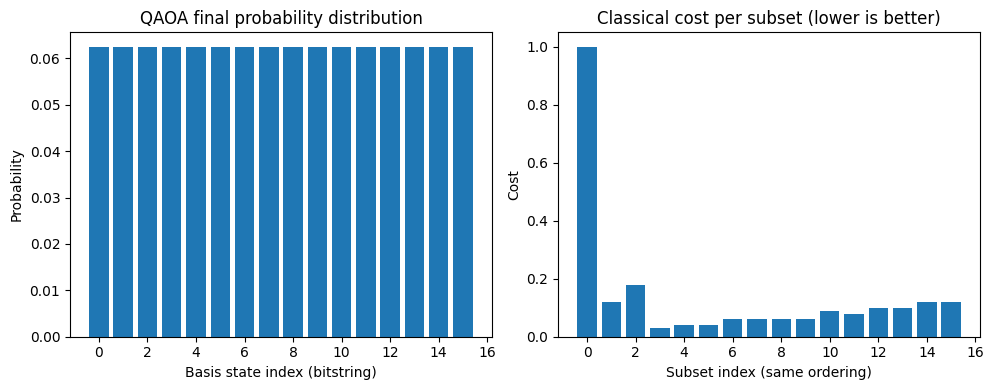

# QAOA for Feature Selection

This project demonstrates how to use the Quantum Approximate Optimization Algorithm (QAOA)
to perform feature selection on a classical machine learning task (Iris binary classification).
We construct a classical cost landscape for every feature subset and embed those costs into
a diagonal quantum cost operator. QAOA is then used to attempt to learn low-cost subsets.

In this simplified circuit (no entanglement + amplitude-phase cost unitary), QAOA produces
a uniform probability distribution. This reveals an important research insight: shallow,
non-entangling QAOA circuits cannot express useful optimization structure.

---

## Project Summary

- Dataset: Iris (binary classification: class 0 vs class 1)
- Task: Evaluate all feature subsets (2^4 = 16 total)
- Classical loss: 1 − cross-validated accuracy (Logistic Regression, 5 folds)
- Penalty: +0.02 * (number of selected features)
- Encode each subset's loss into a diagonal cost Hamiltonian
- Use Qulacs to simulate QAOA with depth p = 2
- Optimize parameters (gamma, beta) with Nelder–Mead
- Measure final probability distribution over all subsets

---

## Motivation

QAOA is a leading variational quantum algorithm for discrete optimization.
Feature selection is a natural testing ground to study hybrid quantum–classical workflows.

This project aims to:
- Build a complete QAOA pipeline
- Understand how classical ML loss can be encoded into a quantum operator
- Examine limitations of shallow QAOA circuits
- Reveal why entanglement and expressive mixers are necessary

---

## Method Overview

### 1. Classical cost evaluation

For each subset S ⊆ {0,1,2,3}:

- Extract the selected features
- Train Logistic Regression on 5-fold cross-validation
- Compute validation loss = 1 − accuracy
- Add a sparsity penalty to encourage fewer features
- Store the final cost value C_s

This produces a classical cost vector of length 16 (one for each bitstring).

---

### 2. QAOA setup in Qulacs

Steps:

1. Prepare the initial state |+>^{⊗4}  
2. Apply the cost unitary  
   U_C(γ) = exp(−i * γ * C)  
   implemented by multiplying each basis amplitude by exp(−iγ C_s)
3. Apply the mixer unitary  
   U_M(β) = ∏ RX(2β)  
   (independent X-rotations on each qubit)
4. Repeat for p = 2 layers
5. Optimize parameters using Nelder–Mead
6. Sample final probability distribution over all subsets

---

## Results

### QAOA Final Probability Distribution

### Classical Cost Landscape
The classical loss function shows that certain feature subsets perform much better than others.

### QAOA Final Distribution (Uniform)
Despite optimization, the QAOA output state is almost perfectly uniform across all 16 bitstrings.

### Interpretation
This occurs because:

- The circuit contains **no entanglement**
- The cost unitary applies **only phases**, which RX mixers cannot convert into amplitude differences
- The ansatz is **not expressive enough** to reflect the cost landscape
- The optimization landscape becomes flat (barren plateau behavior)

This is a known limitation of minimal QAOA and highlights why expressive circuits matter.

---

## Key Takeaways

- The full QAOA workflow is correctly implemented.
- The experiment demonstrates a **failure mode** of shallow QAOA.
- Lack of entanglement prevents phase information from affecting measurement outcomes.
- Future versions should incorporate:
  - entangling mixers (CZ/CNOT chains)
  - Pauli-sum Hamiltonian decomposition
  - deeper circuits (p ≥ 3)
  - warm-start QAOA

Understanding these limitations is essential for QAOA research.

